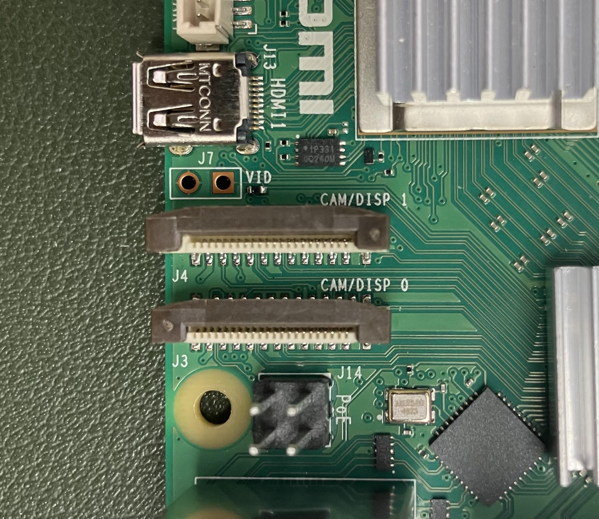
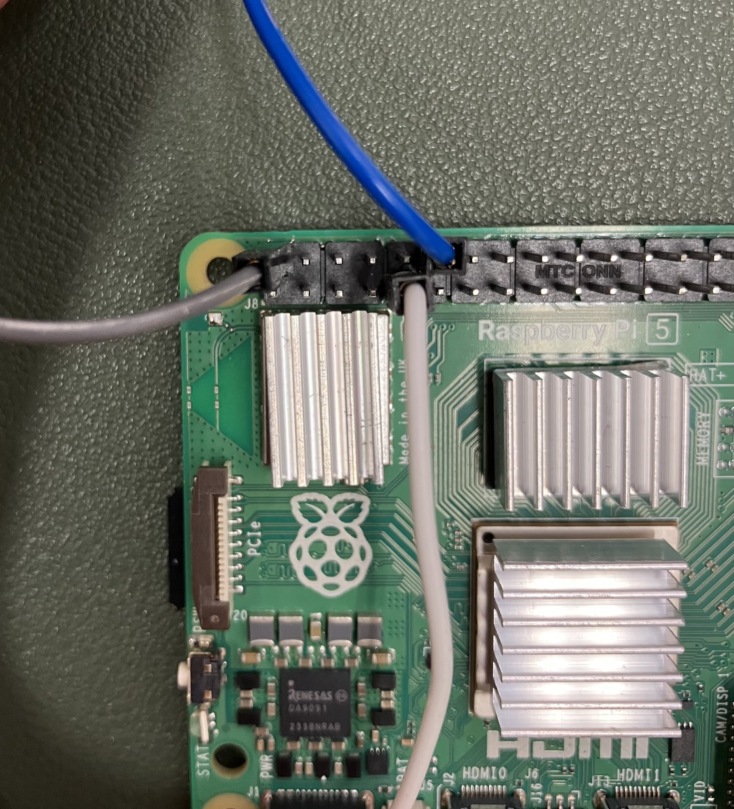
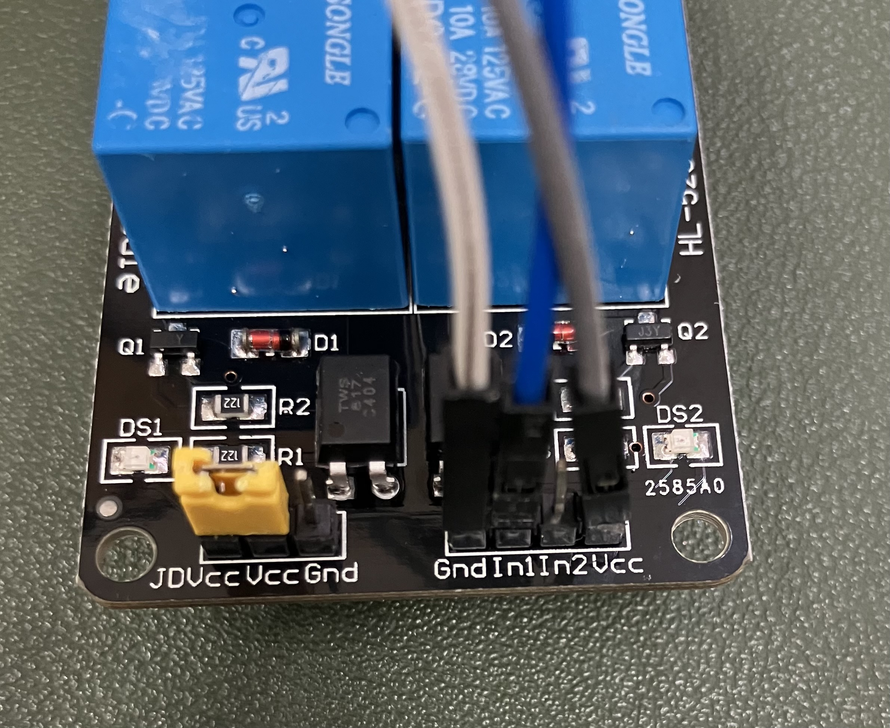
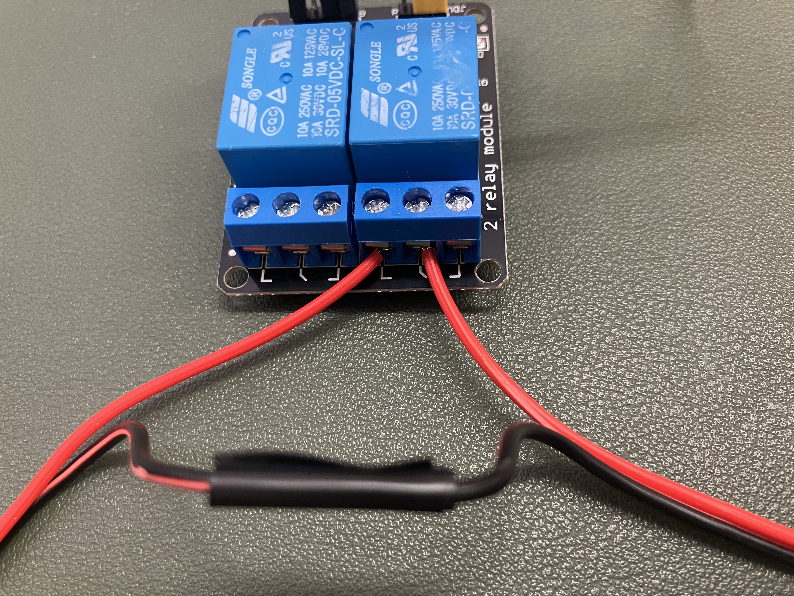

This README is for the [osmiaCAM build instructions](https://github.com/Crall-Lab/osmiaCAM/blob/main/README.md#osmiacam) and [GreenHouse Osmia Block](https://github.com/Crall-Lab/osmiaCAM/blob/main/README.md#greenhouse-osmia-block) build instructions.

# osmiaCAM

## Camera Structure Build

1. Laser Cut all pieces for OsmiaCam Structure build. Per Unit, you should have:
	- 2 Large triangle walls
	- 2 long side walls
	- 2 door pieces (that attach to the long side walls - these are cut from the side walls
	- 1 Camera Platform
	- 1 Y-Shaped Brace
	- 1 Camera Mount
	- 8 Internal Triangle Braces
2. Using acrylic glue, connect one Large triangle wall to one long side wall
3. Use the small bracing triangle and line the seam between the connecting points of the long wall and side walls
4. Repeat steps (2) and (3) with the remaining triangle wall and long wall
5. Allow for the triangle walls and their connected long walls to set (using something to brace the connection between the side walls and long wall to keep the connection at a right angle as much as possible)
6. Once dry, take one combined piece and lay it down so that the triangle wall is flat on a table and the long wall is standing up
7. Adding acrylic glue to one side of the camera platform, fit the in tabs into the cut rectangles in the middle of the triangle wall
8. Adding acrylic glue to one side of the Y-braces fit these pieces in the smaller rectangle openings on the bottom of 
9. Line the remaining connected pieces (triangle wall and long wall) and the top camera platform tabs and top y-brace tabs with glue
10. Fit the second connected piece on top of the flat combined piece, sliding the camera platform tabs into the rectangular openings and the y-brace tabs in the smaller rectangular openings at the bottom.
11. Let glue set
12. Depending on the need to remove cameras, either pop the top piece with camera mounts onto the top of the structure or affix with glue 
13. Set the structure upright, and using tape, attach the long wall doors so that the door can hinge open and closed and have a handle/tab that you can use to open it.
14. Label the structure with the username of its corresponding Raspberry Pi Unit.
15. Your structure is built!

## Labelling Nest Blocks
To help monitor and track which cells are in view and being used by bees, you will need to label the nest block entrances in two places
	
 (1) At the nest entrance (so that the forage camera can view the labels)
 
 (2) At a location that will be inside the nest structure and visible by the internal nest camera
  
Suggested labeling is at minimum every five cells.


## Install Raspberry Pi software
Format SD card using [Raspberry Pi Imager](https://www.raspberrypi.com/software/)

This guide uses a raspberry pi 5, and the 64-bit OS.

## Change device ID
Go to Raspberry Pi COnfiguration and provide a unique username when prompted. *NB user names should be labeled in a repeatable way (e.g., 'osmia1', 'osmia2') to easily associated with physical units. The user name will be saved in output files.

## Pi Connect
Click this:

Input the hostname of the pi as the name of your device when prompted.

Choose 'Turn On Raspberry Pi Connect'. The browser will open. Sign in, using the username of the pi as the device name.

You will now be able to connect to the raspberry pi here: [https://connect.raspberrypi.com/devices](https://connect.raspberrypi.com/devices)

## Connecting cameras
The nest camera should be connected as camera 0 and the external camera should be camera 1. The positions are indicated by CAM/DISP 0 and CAM/DISP 1 on the board of the raspberry pi:


## Check mounting location of external hard drive
run the following in terminal:
```bash
sudo fdisk -l
```
This will list mounted drives, and look for /dev/sda1 in last line.
Hard drives must be mounted at sda1. Do not connect other hard drives to pi.

## Preview camera (to test focus, framing, etc)
```bash
rpicam-hello -t 0 --camera 0 #you should see the nest
```
```bash
rpicam-hello -t 0 --camera 1 #you should see the outside
```

## Take a single full resolution photo
```bash
rpicam-jpeg -o test.jpeg
```

## Setting up RTC
* Note: Requires access with internet
1. Connect RTC battery to slot labelled 'BAT'
2. check that clock is working with sudo hwclock -r
3. Run this:
   ```bash
   sudo hwclock --systohc
   ```
5. Edit configurations,
   ```sudo -E rpi-eeprom-config --edit```
   modifying the two lines (if these variables do not exist, add them):
   ```
   POWER_OFF_ON_HALT = 1
   WAKE_ON_GPIO=0
   ```
7. After adding the lines, ctl+s will save. Then use ctl+x to leave.

## Clone this repository
```bash
git clone https://github.com/Crall-Lab/osmiaCAM.git
```
Move all contents of this repositoty into home directory ('~'). You can do it in the GUI, or input this into the terminal:
```bash
cp -rf osmiaCAM/* ~
```

## Make mount directory
```bash
sudo mkdir /mnt/OsmiaCam
```
If folder exists, it will refuse to make the directory. Ignore it and move on.

## Install libraries for environmental sensors
```bash
sudo pip3 install --break-system-packages adafruit-blinka
sudo pip3 install --break-system-packages adafruit-circuitpython-ms8607
sudo pip3 install --break-system-packages adafruit-circuitpython-ahtx0
```

## Install openCV library
```bash
cd ~
python3 -m venv osmia_2025
source osmia_2025/bin/activate
pip3 install opencv-contrib-python
```

Now it's good to reboot:
```bash
sudo reboot -h now
```

## Add lines to the crontab
Open up crontab with the following command:
```bash
crontab -e
```
Choose 1.
 
Then add the following lines to the bottom of the crontab file if they're not there already (to get permissions and mount directory for external hard drive)
```bash
@reboot sudo systemctl daemon-reload
@reboot sudo mount /dev/sda1 /mnt/OsmiaCam -o umask=000
@reboot sudo chmod 777 /mnt/OsmiaCam
*/10 * * * * /usr/bin/python dayShift1.py
*/3 * * * * /usr/bin/python dayShift0.py
@reboot /usr/bin/python nightShift.py
0 20 * * * /usr/bin/python nightShift.py
* * * * * /usr/bin/python3 envSensing.py >> envLog.txt 2>&1
```
After adding the lines, ctl+s will save. Then use ctl+x to leave.

*NB if you want to use the camera (e.g, for preview, check focus, or to troubleshoot record.py script), turn off autoamted recording by commenting out that last line

Restart computer after updating crontab. osmiaCAM should run automatically after this.
```bash
sudo reboot -h now
```

## Lighting
In order to use the relay module to control the lights automatically, the raspberry pi, relay, and lights must be connected properly. The images below illustrate pin/wire locations on the raspberry pi and relay module. To insert wires to the relay, use a screwdriver.





* Note that only the black ends should be soldered together.

The two wires coming from the relay can then be plugged into the lights and battery. The configuration does not matter.

## Turn on GPIO pins
Click on the raspberry --> settings --> Raspberry PI Configuration --> Interfaces --> turn on SPI and I2C

## Attaching LED Lights
1. Attach LED light wires to Screw Connector [Red is positive(+) and Black is negative (-)]
	To attach the wired to the screw connector loosen both screws and slide the correct wires into its corresponding slot and then using a screw driver tighten the screws so the wires are secure
2. Line the path/areas over which the lights will lay using black (or blue) masking tape
		To diffuse the portions of lights that will line the camera mount (top of structure) use separate pieces so that if needed the camera mount pieces can slide off if needed.
3. With the screw connector end starting at the base of the structure line the lights across the tape with the LED facing down securing with strips of tape
	We want there to be slack in the connection between the lights and the Pi, so start lining the lights to that the actual lights are starting on the structure and the wires are off the edge of the structure.
	The lights should run vertically up one side of the long wall across the top of the camera mount and down the opposite side wall; the lights should curve at the base of the long wall and then work back up vertically up and down the other sides of the side walls.
4. Once lights are lining the structure, using duct tape, secure and cover the light path
	The tape should cover the lights, securing the LED light down to the structure
	To cover the portion of lights lining the camera mount (top of structure) use separate pieces so that if needed, the camera mount pieces can slide off if needed.
5. Cut off the excess light string where needed

## Testing
Restart and come back after 2 hours to check if expected files are in expected locations on hard drive. OsmiaCam should be created, with nestCam and ExtCam within. Each day will have each own folder within that. osmiaCAM will create 9 min 45 s video every 10 min of outside, 10s video of nest every 3 minutes during the day and every hour at night.

## Deployment
While deploying, it is advisable to check the focus of the camera and adjust as needed, even if the unit has been built and tested in the lab. However, if the above steps have been executed successfully, the normal functioning of the unit will interfer with this. To avoid this, edit the crontab:
```bash
crontab -e
```
Now comment out the lines that refer to dayShift and nightShift scripts. It should look like this:
```bash
@reboot sudo systemctl daemon-reload
@reboot sudo mount /dev/sda1 /mnt/OsmiaCam -o umask=000
@reboot sudo chmod 777 /mnt/OsmiaCam
#*/10 * * * * /usr/bin/python dayShift1.py
#*/3 * * * * /usr/bin/python dayShift0.py
#@reboot /usr/bin/python nightShift.py
#0 20 * * * /usr/bin/python nightShift.py
* * * * * /usr/bin/python3 envSensing.py >> envLog.txt 2>&1
```
Remember to uncomment these lines before actually deploying the unit. Note also that nightShift runs at startup and will put the unit to sleep after 10 seconds. If a unit must be deployed at night, edit the crontab during the day ahead of time.

## Check videos
Videos are recorded as .h264s, which are great for file sizes but a bit cumbersome to convert and view. We have written some utility functions to help out with this. 
First, for the nest and outside videos, a single frame from each video is now output automatically to check framing, etc
Second, you can first convert 'raw' h264 videos to mp4 on the pi with the 'converth264.py' function, and then view them with the 'play_mp4.py' script. Here's an example:

### Install openCV library
First if you haven't already, create a virtual environment and install openCV

```bash
cd ~
python3 -m venv osmia_2025
source osmia_2025/bin/activate
pip3 install opencv-contrib-python
```

Then run this in terminal:
```bash
cd ~
source osmia_2025/bin/activate
python3 converth264.py
```
This will prompt you for a filename. The easiest way to get this when communicating over Raspberry Pi Connect is by navigating to the h264 file you'd like to view, selecting 'copy path' under 'Edit' in the file browser, then click 'copy from remote'. Then in the window prompt, click 'paste to remote' back in the Terminal window

After a few moments (maybe a couple minutes for full sized videos), there should now be an mp4 video with the same filename. To view this file, now run:

```bash
python3 play_mp4.py
```
This will again prompt you for a filename, which now you'll have to add as the 'mp4' file, as above

### playback timelapse

```bash
source osmia_2025/bin/activate
cd ~/osmiaCAM
python3 playback_stills.py
```


# GreenHouse Osmia Block 
## Install Raspberry Pi software
Format SD card using [Raspberry Pi Imager](https://www.raspberrypi.com/software/)

This guide uses a raspberry pi 5, and the 64-bit OS.

## Change device ID
Go to Raspberry Pi Configuration and provide a unique username when prompted. *NB user names should be labeled in a repeatable way (e.g., 'osmia1', 'osmia2') to easily associated with physical units. The user name will be saved in output files.

## Pi Connect
Click this:

Input the hostname of the pi as the name of your device when prompted.

Choose 'Turn On Raspberry Pi Connect'. The browser will open. Sign in, using the username of the pi as the device name.

You will now be able to connect to the raspberry pi here: [https://connect.raspberrypi.com/devices](https://connect.raspberrypi.com/devices)

## Connecting cameras
The external camera should be camera 1. The position is indicated by CAM/DISP 1 on the board of the raspberry pi:


## Check mounting location of external hard drive
run the following in terminal:
```bash
sudo fdisk -l
```
This will list mounted drives, and look for /dev/sda1 in last line.
Hard drives must be mounted at sda1. Do not connect other hard drives to pi.

## Preview camera (to test focus, framing, etc)
```bash
rpicam-hello -t 0 --camera 1 #you should see nest block face
```

## Take a single full resolution photo
```bash
rpicam-jpeg -o test.jpeg --camera 1
```
## Setting up RTC
* Note: Requires access with internet
1. Connect RTC battery to slot labelled 'BAT'
2. check that clock is working with sudo hwclock -r
3. Run this:
   ```bash
   sudo hwclock --systohc
   ```
5. Edit configurations,
   ```
   sudo -E rpi-eeprom-config --edit
   ```
   modifying the two lines (if these variables do not exist, add them):
   ```
   POWER_OFF_ON_HALT = 1
   WAKE_ON_GPIO=0
   ```
7. After adding the lines, ctl+s will save. Then use ctl+x to leave.

## Clone this repository
```bash
git clone https://github.com/Crall-Lab/osmiaCAM.git
```
Move all contents of this repositoty into home directory ('~'). You can do it in the GUI, or input this into the terminal:
```bash
cp -rf osmiaCAM/* ~
```

## Make mount directory
```bash
sudo mkdir /mnt/OsmiaCam
```
If folder exists, it will refuse to make the directory. Ignore it and move on.

## Install openCV library
```bash
cd ~
python3 -m venv osmia_2025
source osmia_2025/bin/activate
pip3 install opencv-contrib-python
```

Now it's good to reboot:
```bash
sudo reboot -h now
```

## Add lines to the crontab
Open up crontab with the following command:
```bash
crontab -e
```
Choose 1.

Then add the following lines to the bottom of the crontab file if they're not there already (to get permissions and mount directory for external hard drive)
```bash
@reboot sudo systemctl daemon-reload
@reboot sudo mount /dev/sda1 /mnt/OsmiaCam -o umask=000
@reboot sudo chmod 777 /mnt/OsmiaCam
*/10 * * * * /usr/bin/python greenHouse.py
```

After adding the lines, ctl+s will save. Then use ctl+x to leave.

*NB if you want to use the camera (e.g, for preview, check focus, or to troubleshoot record.py script), turn off autoamted recording by commenting out that last line

Restart computer after updating crontab. osmiaCAM should run automatically after this.
```bash
sudo reboot -h now
```

## Testing
Restart and come back after 2 hours to check if expected files are in expected locations on hard drive. OsmiaCam should be created, with nestCam and ExtCam within. Each day will have each own folder within that. osmiaCAM will create 9 min 45 s video every 10 min of outside, 10s video of nest every 3 minutes during the day and every hour at night.

## Deployment
While deploying, it is advisable to check the focus of the camera and adjust as needed, even if the unit has been built and tested in the lab. However, if the above steps have been executed successfully, the normal functioning of the unit will interfer with this. To avoid this, edit the crontab:
```bash
crontab -e
```
Now comment out the lines that refer to dayShift scripts. It should look like this:
```bash
@reboot sudo systemctl daemon-reload
@reboot sudo mount /dev/sda1 /mnt/OsmiaCam -o umask=000
@reboot sudo chmod 777 /mnt/OsmiaCam
#*/10 * * * * /usr/bin/python greenHouse.py
```

Remember to uncomment these lines before actually deploying the unit.


## Check videos
Videos are recorded as .h264s, which are great for file sizes but a bit cumbersome to convert and view. We have written some utility functions to help out with this. 
First, for the nest and outside videos, a single frame from each video is now output automatically to check framing, etc
Second, you can first convert 'raw' h264 videos to mp4 on the pi with the 'converth264.py' function, and then view them with the 'play_mp4.py' script. Here's an example:

## Install openCV library
First if you haven't already, create a virtual environment and install openCV

```bash
cd ~
python3 -m venv osmia_2025
source osmia_2025/bin/activate
pip3 install opencv-contrib-python
```

Then run this in terminal:
```bash
cd ~
source osmia_2025/bin/activate
python3 converth264.py
```
This will prompt you for a filename. The easiest way to get this when communicating over Raspberry Pi Connect is by navigating to the h264 file you'd like to view, selecting 'copy path' under 'Edit' in the file browser, then click 'copy from remote'. Then in the window prompt, click 'paste to remote' back in the Terminal window

After a few moments (maybe a couple minutes for full sized videos), there should now be an mp4 video with the same filename. To view this file, now run:

```bash
python3 play_mp4.py
```
This will again prompt you for a filename, which now you'll have to add as the 'mp4' file, as above
